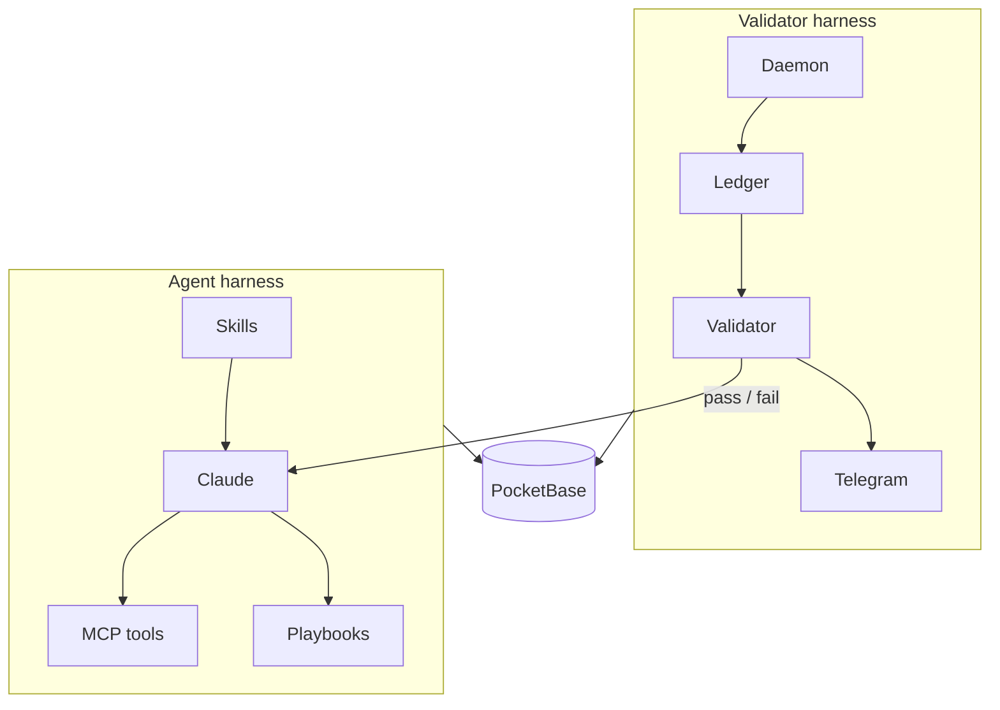

# splatt-ops

This is the operations system I built for Splatt Engineering, a small NZ
company that supplies and services bottling and food-processing machines.
It runs the admin side of the business: jobs, quotes, invoices, follow-ups,
and the Todoist board everything hangs off.

Claude does a lot of the day-to-day work through MCP tools, and a
separate validator checks that work afterwards.

> This is a public copy of a system that's in daily use, so every client,
> supplier, person, price and reference number has been swapped for
> made-up data.

## Two harnesses, one on top of the other

The system is built as two harnesses. The agent harness controls what
Claude can do while it works. The validator harness sits on top of it and
checks the result afterwards, without trusting anything the agent says.



### The agent harness

This is everything that shapes how Claude works.

- Skills (`skills/`) are the instructions Claude follows: what it may and
  may not do (it never sends email, never creates invoices on its own),
  and the order of an ops run.
- The MCP server (`mcp_server/`) is the only way Claude can change the
  database. Every write is checked against the schema before it's sent and
  read back afterwards, so a failed write comes back as an error instead
  of "done".
- Playbooks (`server/`, reached through `playbook_mcp/`) handle longer
  procedures like filing a supplier quote. Each step has to be done in
  order, and the server won't accept a step until its evidence checks out
  (the file exists, the record is there).

### The validator harness

This is the layer on top. It doesn't care what the agent reports, only
what's actually in the database, Todoist and the project folders.

- The daemon (`daemon/`) runs every 60 seconds. It keeps Todoist and
  PocketBase in sync, moves jobs forward when their tasks are done, and
  escalates overdue work once a day. Every write it makes goes into a
  ledger, so it can be checked later.
- The validator (`validator/`) re-reads the ledger and checks the 36 rules
  in `config/validation-rules.yaml`. For example: a job marked invoiced
  needs an invoice record, and freight paid to a courier has to be charged
  on to the client.
- It exits 0 (pass), 1 (blocked) or 2 (couldn't run), and posts the result
  straight to a Telegram channel.

### Where the two meet

At the end of every run, Claude has to run the validator and report its
result, not its own summary. If the validator says blocked, Claude can't
call the job finished, and the Telegram message goes out either way.

The daemon also runs the validator by itself if the ops channel has been
quiet for 12 hours, so checking doesn't depend on the agent remembering
to do it.

More detail on both harnesses, including the gaps that still exist, is in
[docs/HARNESSES.md](docs/HARNESSES.md). Every component is described in
[docs/ARCHITECTURE.md](docs/ARCHITECTURE.md).

## Repo layout

| Folder | What's in it |
|---|---|
| `core/` | PocketBase and Todoist clients, the write ledger, and the logic that matches tasks to clients and jobs |
| `daemon/` | The background loop: sync, triggers, the overdue ladder, backups |
| `validator/` | The validator. Its rules live in `config/validation-rules.yaml` |
| `mcp_server/`, `playbook_mcp/` | The MCP servers Claude uses |
| `skills/` | The instructions Claude follows |
| `server/` | Node server for project files and playbooks |
| `dashboard/` | The dashboard, a single HTML page (React, no build step) |
| `tools/` | Demo data, Todoist setup, backups, schema tools |
| `tests/` | Around 1,200 tests |

## Running the demo

The demo loads a made-up business into a local PocketBase, so you can see
the dashboard and run the validator without any accounts. It takes about
10 minutes. You'll need Python 3.10+, Node 18+ and the PocketBase binary.
The full steps are in [docs/INSTALL.md](docs/INSTALL.md), Part A. The
short version, on an Apple Silicon Mac:

```bash
git clone https://github.com/michaelberns/splatt-ops-public.git && cd splatt-ops-public
python3.12 -m venv .venv && .venv/bin/pip install -r requirements.txt

curl -L -o pb.zip https://github.com/pocketbase/pocketbase/releases/download/v0.25.9/pocketbase_0.25.9_darwin_arm64.zip
unzip -o pb.zip pocketbase && rm pb.zip
./pocketbase superuser upsert admin@example.com 'choose-a-long-password' --dir pb_data
cp .env.example .env                  # then fill in PB_ADMIN_EMAIL and PB_ADMIN_PASSWORD
cp dashboard/config.example.js dashboard/config.local.js

./pocketbase serve --http=127.0.0.1:8090 --dir=pb_data &
.venv/bin/python -m tools.seed_demo --write
SS_FOLDERS_PATH="$PWD/examples/SS Folders" node server/project-files-server.js &
open dashboard/index.html

SPLATT_ROOT="$PWD/examples" .venv/bin/python -m validator run --no-todoist
```

The last command should come back BLOCKED. That's expected: the demo data
has a few gaps in it (a job marked won with no quote on file, for one), and
finding those is the validator's job.

## Tests

```bash
.venv/bin/python -m pytest
```

They run offline against a fake PocketBase and a fake Todoist in
`tests/fakes.py`.

## Stack

Python 3.12, PocketBase 0.25, Node 22, React 18 in a single HTML file,
the Todoist and Telegram APIs, and Claude over MCP.

## Author

Michael Berns
