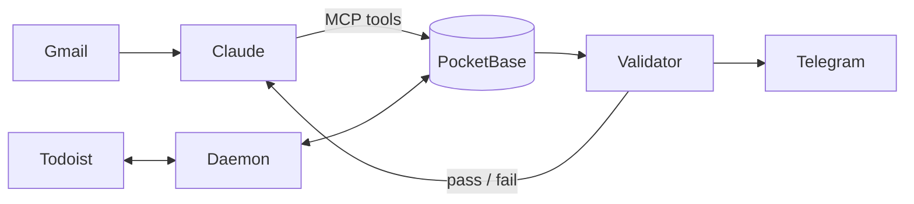

# splatt-ops

This is the operations system I built for Splatt Engineering, a small NZ
company that supplies and services bottling and food-processing machines.
It runs the admin side of the business: jobs, quotes, invoices, follow-ups,
and the Todoist board everything hangs off.

Claude does a lot of the day-to-day work through MCP tools. A separate
validator then checks that work, and it doesn't take Claude's word for
anything.

> This is a public copy of a system that's in daily use, so every client,
> supplier, person, price and reference number has been swapped for
> made-up data.

## Why it's built this way

The first version was a pile of scripts writing to PocketBase from
different places. One of them, the client sync, failed on every record
for months and nothing flagged it, because the code reported a write as
done without checking that it had actually landed.

That shaped everything after it. An AI agent has the same failure mode,
just more often. It will tell you it updated a job when the write was
rejected, or skip a step and still call the run finished. But it's very
good at the part plain code can't do, which is reading an email thread
and working out what actually happened.

So Claude does the reading and deciding, and plain Python checks the
result. The agent never gets to decide whether it succeeded.

## How it fits together



Claude reads the email and makes changes through the MCP server
(`mcp_server/`). Every write is checked against the schema before it's
sent and read back afterwards, so a dropped write comes back as an error
instead of "done".

The daemon (`daemon/`) runs every 60 seconds. It mirrors the Todoist board
into PocketBase, moves a job forward when the task that finishes it is
ticked off, and once a day escalates overdue tasks: flagged after 3 days,
an alert after 7, parked as stalled after 28. Every write it makes goes
into a ledger.

The validator (`validator/`) runs at the end of every agent session, and
the daemon also runs it if the ops channel has been quiet for 12 hours. It re-reads the
ledger, checks the 36 rules in `config/validation-rules.yaml`, and exits
0 (pass), 1 (blocked) or 2 (couldn't run). Claude has to report that
result rather than its own summary. The validator also posts straight to
a Telegram channel, so a failed run can't just be left out of the report.

Longer procedures, like filing a supplier quote, go through playbooks.
That's a small state machine in `server/` that won't accept a step until
the evidence for it checks out (the file exists, the record is there).

Some examples of what the rules catch: a job marked invoiced with no
invoice record, freight paid to a courier but never charged on to the
client, a quote that's been sitting for a week with no follow-up.

Where the code isn't sure, it refuses rather than guessing. If a task
title matches two clients, it links neither and leaves it for Claude or
me to sort out, and that decision then goes through the same checks as
everything else.

The longer version, including the gaps that still exist, is in
[docs/HARNESSES.md](docs/HARNESSES.md). Every component is described in
[docs/ARCHITECTURE.md](docs/ARCHITECTURE.md).

## Repo layout

| Folder | What's in it |
|---|---|
| `core/` | PocketBase and Todoist clients, the write ledger, and the logic that matches tasks to clients and jobs |
| `daemon/` | The background loop: sync, triggers, the overdue ladder, backups |
| `validator/` | The validator. Its rules live in `config/validation-rules.yaml` |
| `mcp_server/`, `playbook_mcp/` | The MCP servers Claude uses |
| `skills/` | The instructions Claude follows |
| `server/` | Node server for project files and playbooks |
| `dashboard/` | The dashboard, a single HTML page (React, no build step) |
| `tools/` | Demo data, Todoist setup, backups, schema tools |
| `tests/` | Around 1,200 tests |

## Running the demo

The demo loads a made-up business into a local PocketBase, so you can see
the dashboard and run the validator without any accounts. It takes about
10 minutes. You'll need Python 3.10+, Node 18+ and the PocketBase binary.
The full steps are in [docs/INSTALL.md](docs/INSTALL.md), Part A. The
short version, on an Apple Silicon Mac:

```bash
git clone https://github.com/michaelberns/splatt-ops-public.git && cd splatt-ops-public
python3.12 -m venv .venv && .venv/bin/pip install -r requirements.txt

curl -L -o pb.zip https://github.com/pocketbase/pocketbase/releases/download/v0.25.9/pocketbase_0.25.9_darwin_arm64.zip
unzip -o pb.zip pocketbase && rm pb.zip
./pocketbase superuser upsert admin@example.com 'choose-a-long-password' --dir pb_data
cp .env.example .env                  # then fill in PB_ADMIN_EMAIL and PB_ADMIN_PASSWORD
cp dashboard/config.example.js dashboard/config.local.js

./pocketbase serve --http=127.0.0.1:8090 --dir=pb_data &
.venv/bin/python -m tools.seed_demo --write
SS_FOLDERS_PATH="$PWD/examples/SS Folders" node server/project-files-server.js &
open dashboard/index.html

SPLATT_ROOT="$PWD/examples" .venv/bin/python -m validator run --no-todoist
```

The last command should come back BLOCKED. That's expected: the demo data
has a few gaps in it (a job marked won with no quote on file, for one), and
finding those is the validator's job.

## Tests

```bash
.venv/bin/python -m pytest
```

They run offline against a fake PocketBase and a fake Todoist in
`tests/fakes.py`.

## Stack

Python 3.12, PocketBase 0.25, Node 22, React 18 in a single HTML file,
the Todoist and Telegram APIs, and Claude over MCP.

## Author

Michael Berns
