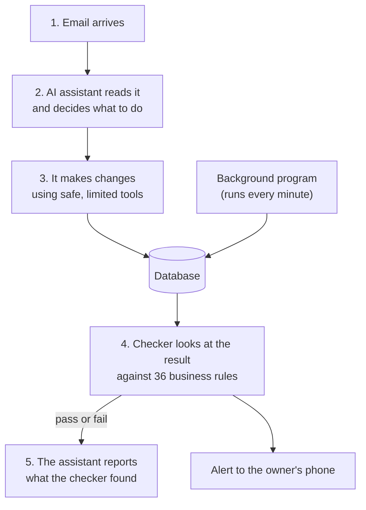

# splatt-ops

A system that runs the day-to-day operations of a small engineering
business, with an AI assistant doing the work and ordinary code checking
that the work was actually done.

> This is a public copy of a system in real daily use. All client,
> supplier and people names, prices and reference numbers have been
> replaced with made-up ones.

## What it is

Splatt Engineering supplies and services machines for bottling and food
factories. Most of its work starts as an email: a client asks for a price,
a supplier sends a quote, a delivery arrives. Each email means updating
several places: the to-do list (Todoist), the customer records, the
project files and the accounts (Xero).

This project connects all of those. It has:

- **a database** of clients, jobs, quotes and invoices,
- **a background program** that keeps the to-do list and the database in
  sync and follows up on work that is running late,
- **a dashboard** that shows everything in one place,
- **an AI assistant** (Claude) that reads the email and does the updates,
- **a checker** that confirms the assistant's work is really done.

## The problem it solves

An AI assistant is good at understanding things. It can read a long email
thread and work out that "yes, go ahead with option B" means the client
accepted the quote.

But it is not reliable at bookkeeping. It can:

- say it saved something when the save failed,
- skip a step and not notice,
- report "all done" because it *remembers* doing the work, not because it
  checked.

Ordinary code is the opposite: it cannot read an email, but it never skips
a step and can check every claim. So this system gives each side the job
it is good at.

## How it works



1. **An email arrives.** The AI assistant reads it and decides what needs
   to happen.
2. **It makes the changes using limited tools.** It cannot write to the
   database freely. Every save is checked before it is sent and read back
   afterwards, so a failed save is reported as a failure.
3. **Routine work is done by the background program,** not the assistant.
   Every minute it syncs the to-do list with the database. Once a day it
   moves overdue tasks up an escalation ladder: overdue after 1 day, marked
   urgent after 3, an alert after 7, parked after 28.
4. **At the end, a separate checker reviews the result.** It does not
   trust anything the assistant says. It reads the database and the
   project folders itself and applies 36 rules. For example: a job marked
   "invoiced" must have an invoice, and freight paid to a courier must be
   charged on to the client.
5. **The assistant must report the checker's answer,** not its own
   opinion. If the checker says something is wrong, the assistant is not
   allowed to say the job is finished. The checker also sends its result
   straight to the owner's phone (Telegram), so a problem cannot be hidden.

## What catches what

| If the AI assistant... | ...this catches it |
|---|---|
| saves to a field that does not exist | the tool refuses the save and names the field |
| says it saved something, but the save failed | the tool reads the record back and reports the failure |
| skips a step in a multi-step job | the step-by-step "playbook" will not move on without proof |
| marks a job as invoiced with no invoice | the checker's rules fail the job |
| forgets to chase a client | the background program creates the reminder itself |
| reports success while rules are failing | the checker blocks it and alerts the owner directly |

When the code is unsure (for example, two clients have similar names), it
does not guess. It leaves the decision to the assistant or the owner, and
that decision is then checked like everything else.

The full explanation is in **[docs/HARNESSES.md](docs/HARNESSES.md)**.

## What's in this repository

| Folder | What it holds |
|---|---|
| [`core/`](core/) | Shared code: talking to the database and Todoist, and the logic for matching tasks to clients and jobs |
| [`daemon/`](daemon/) | The background program (sync, reminders, overdue ladder, backups) |
| [`validator/`](validator/) | The checker. Its rules are in [`config/validation-rules.yaml`](config/validation-rules.yaml) |
| [`mcp_server/`](mcp_server/), [`playbook_mcp/`](playbook_mcp/) | The limited tools the AI assistant is allowed to use |
| [`skills/`](skills/) | The written instructions the AI assistant follows |
| [`server/`](server/) | A small server for project files and step-by-step playbooks |
| [`dashboard/`](dashboard/) | The dashboard (a single web page) |
| [`tools/`](tools/) | Helper scripts: demo data, setup, backups |
| [`tests/`](tests/) | About 1,200 automated tests |

How the parts fit together: **[docs/ARCHITECTURE.md](docs/ARCHITECTURE.md)**.

## Try it

You can run a demo with a made-up business in about 10 minutes, without
any accounts. You need Python 3.10 or newer, Node.js 18 or newer, and the
free PocketBase database program.

Follow **Part A** of **[docs/INSTALL.md](docs/INSTALL.md)**. You will get
the dashboard with sample clients, jobs, overdue tasks and a map of
installed machines, and you can run the checker to see it find problems
in the sample data.

<details>
<summary>Short version of the demo commands (macOS, Apple Silicon)</summary>

```bash
git clone https://github.com/michaelberns/splatt-ops-public.git && cd splatt-ops-public
python3.12 -m venv .venv && .venv/bin/pip install -r requirements.txt

curl -L -o pb.zip https://github.com/pocketbase/pocketbase/releases/download/v0.25.9/pocketbase_0.25.9_darwin_arm64.zip
unzip -o pb.zip pocketbase && rm pb.zip
./pocketbase superuser upsert admin@example.com 'choose-a-long-password' --dir pb_data
cp .env.example .env                  # then fill in PB_ADMIN_EMAIL and PB_ADMIN_PASSWORD
cp dashboard/config.example.js dashboard/config.local.js

./pocketbase serve --http=127.0.0.1:8090 --dir=pb_data &
.venv/bin/python -m tools.seed_demo --write
SS_FOLDERS_PATH="$PWD/examples/SS Folders" node server/project-files-server.js &
open dashboard/index.html

SPLATT_ROOT="$PWD/examples" .venv/bin/python -m validator run --no-todoist
```

</details>

## Running the tests

```bash
.venv/bin/python -m pytest
```

The tests run offline, using fake versions of the database and Todoist.

## Built with

Python, PocketBase (database), Node.js, React (dashboard), the Todoist and
Telegram APIs, and Claude with the Model Context Protocol (MCP) for the AI
assistant.

## Further reading

- [docs/INSTALL.md](docs/INSTALL.md): step-by-step setup, from demo to full use
- [docs/HARNESSES.md](docs/HARNESSES.md): how the AI and the checker keep each other honest, and the current limitations
- [docs/ARCHITECTURE.md](docs/ARCHITECTURE.md): every part of the system in detail

## Author

Michael Berns. Built for and used at Splatt Engineering.
