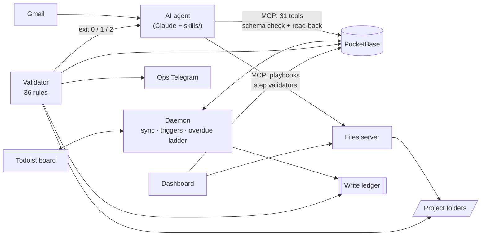

# splatt-ops

An operations system for a small industrial engineering business, built
around an AI agent whose work is checked by an independent, rule-based
validator.

The business (Splatt Engineering, which supplies and services bottling and
food-processing equipment) runs on email, a Todoist board, project
folders and Xero. This repository connects them: a database of clients,
jobs, quotes and invoices; a background process that keeps the task board
and the database in step and escalates overdue work; a dashboard; and an
AI agent (Claude) that reads email, decides what needs doing and does it.

The interesting part is not the agent on its own. It is how the agent is
constrained while it works and how its results are checked afterwards, so
that "the agent said it was done" and "it is done" are forced to be the
same thing. That design is explained in
**[docs/HARNESSES.md](docs/HARNESSES.md)**.

> This is the public edition of a system in daily use. Every client,
> supplier, person, price and reference number in this repository has been
> replaced with fictional data, and the git history starts at the public
> release.

## What it does

- **Keeps one source of truth per kind of data.** Tasks live in Todoist,
  relationships and job state in PocketBase, documents in project folders,
  money in Xero. A daemon mirrors the Todoist board into the database every
  60 seconds and pushes dashboard edits back.
- **Moves work forward automatically.** Completing a task marked
  `🔁 On complete: job to quoted` moves the job to `quoted`. A quote left
  unanswered for 7 days gets a chase task, scheduled into a free slot.
- **Escalates overdue work on a ladder** measured from the date a task was
  *first* due (1 day: move to Overdue, 3: escalate, 7: alert, 28: park as
  Stalled), and routes tasks that are waiting on a client or supplier into
  their own columns with business-day chase dates.
- **Gives an AI agent safe tools.** 31 database tools over MCP, each write
  checked against the schema before sending and read back after. A
  playbook engine makes multi-step procedures run in order, with a
  validator on every step.
- **Checks everything independently.** A validator with 36 declarative
  rules (standing checks, per-status gates, and money rules that can never
  be waived) decides whether a run may be reported as a success. It exits
  0, 1 or 2, and posts its verdict to its own Telegram channel.
- **Shows it all on one dashboard**: pipeline, workload board, timeline,
  map of installed equipment, project files, per-project money ledger, and
  a streamer mode that masks client data for screen sharing.

## Architecture at a glance



| Part | Folder | In one sentence |
|---|---|---|
| Shared library | [`core/`](core/) | Database and Todoist clients, the write ledger, and pure "planner" modules that decide changes without touching the network. |
| Daemon | [`daemon/`](daemon/) | The always-on loop: sync, reverse sync, triggers, the overdue ladder, backups, Telegram outbox. |
| Validator | [`validator/`](validator/), [`config/validation-rules.yaml`](config/validation-rules.yaml) | The independent checker that decides whether the agent may report success. |
| Agent tools | [`mcp_server/`](mcp_server/), [`playbook_mcp/`](playbook_mcp/) | What the agent is allowed to call. |
| Agent instructions | [`skills/`](skills/) | The Markdown "skills" Claude loads: hard rules, the ops cycle, data conventions. |
| Files and playbook server | [`server/`](server/) | Node server for project files, the playbook state machine, logs and the dashboard's feeds. |
| Dashboard | [`dashboard/`](dashboard/) | A single-file React app with four tested helper engines. |
| Tools | [`tools/`](tools/) | Schema introspection, backups, demo data, Todoist setup, the skill harness, the hosted-dashboard build. |

More detail: **[docs/ARCHITECTURE.md](docs/ARCHITECTURE.md)**.

## The core idea in one paragraph

An AI agent is good at judgement (reading a thread and working out that a
quote was accepted) and bad at bookkeeping (it will report a database
write that never happened, or skip a step, and then say it is finished).
Plain code is the reverse. So the agent only gets tools that verify their
own writes, multi-step jobs run through a state machine that will not
accept a step without evidence, routine work is taken off the agent by a
daemon that logs every write it makes, and at the end of every run an
independent validator re-reads those claims and checks the business rules.
The agent must report from the validator's verdict, not from memory, and
the validator reports to the operator directly as well. Where the code is
unsure (two clients match a name, an email only *probably* confirms a
delivery), it refuses rather than guesses and hands the case to the agent,
whose decision then goes through the same checks. The full explanation,
with a table of which layer catches which failure, is in
[docs/HARNESSES.md](docs/HARNESSES.md).

## Quick start (demo, about 10 minutes)

Needs Python 3.10+ (macOS ships 3.9, so install a newer one first), Node 18+
and the PocketBase 0.25 binary. No accounts.

```bash
git clone https://github.com/michaelberns/splatt-ops-public.git && cd splatt-ops-public
python3.12 -m venv .venv && .venv/bin/pip install -r requirements.txt   # any Python 3.10+

# PocketBase (Apple Silicon shown; see docs/INSTALL.md for other platforms)
curl -L -o pb.zip https://github.com/pocketbase/pocketbase/releases/download/v0.25.9/pocketbase_0.25.9_darwin_arm64.zip
unzip -o pb.zip pocketbase && rm pb.zip

./pocketbase superuser upsert admin@example.com 'choose-a-long-password' --dir pb_data
cp .env.example .env        # then set PB_ADMIN_EMAIL and PB_ADMIN_PASSWORD
cp dashboard/config.example.js dashboard/config.local.js

./pocketbase serve --http=127.0.0.1:8090 --dir=pb_data &
.venv/bin/python -m tools.seed_demo --write                    # fictional demo business
SS_FOLDERS_PATH="$PWD/examples/SS Folders" node server/project-files-server.js &
open dashboard/index.html

SPLATT_ROOT="$PWD/examples" .venv/bin/python -m validator run --no-todoist   # see the validator at work
```

Step-by-step instructions, the full setup with Todoist, Telegram and
Claude, and troubleshooting: **[docs/INSTALL.md](docs/INSTALL.md)**.

## Tests

```bash
.venv/bin/python -m pytest      # about 1,200 tests, offline
npm install && npm test         # the dashboard engine suites
```

Almost everything runs offline against a fake PocketBase and a fake
Todoist (`tests/fakes.py`). The dashboard, which is compiled by Babel in
the browser, is compiled during the test run so a syntax error fails a
test instead of a page load.

## Tech stack

Python 3.12 (httpx, PyYAML, the MCP SDK, pytest) · PocketBase 0.25 (SQLite)
· Node 22 (files server, no dependencies) · React 18, Tailwind and Leaflet
in a single HTML file · Todoist API v1 · Telegram Bot API · Claude (MCP
servers and skills) · Cloudflare Pages for the optional hosted copy.

## Design decisions worth pointing out

- **Refuse rather than guess.** Every automatic linker (client matching,
  job matching, "does this email prove the task is done") returns a
  refusal with a reason when it is not sure. A wrong automatic link is
  harder to find than a missing one.
- **Claims are separate from facts.** Writers append what they claim to
  have written to a ledger; the validator re-reads the database to decide
  whether it is true. The code that did the work never marks its own work.
- **Nothing is deleted automatically.** The daemon marks, moves and
  escalates; completing or deleting is left to a person or to an explicit
  rule.
- **Configuration in one place.** Every port, id, path and threshold is in
  `config/settings.yaml`, every secret in `.env`, every validation rule in
  `config/validation-rules.yaml`. The database schema is generated into
  `core/schema.py`, and a rule fails if the two drift.
- **Waivers expire.** A bypass lasts 72 hours; a temporary exception must
  have an end date no more than 90 days away. Money rules cannot be waived.

## Known limitations

Listed honestly in [docs/HARNESSES.md](docs/HARNESSES.md#6-known-limitations).
The main one: writes the agent makes through the MCP tools are verified at
the moment they happen but are not added to the write ledger, so the
validator checks their *result* (through its business rules) but does not
re-read each one individually.

## Author

Michael Berns. Built for and used at Splatt Engineering.
