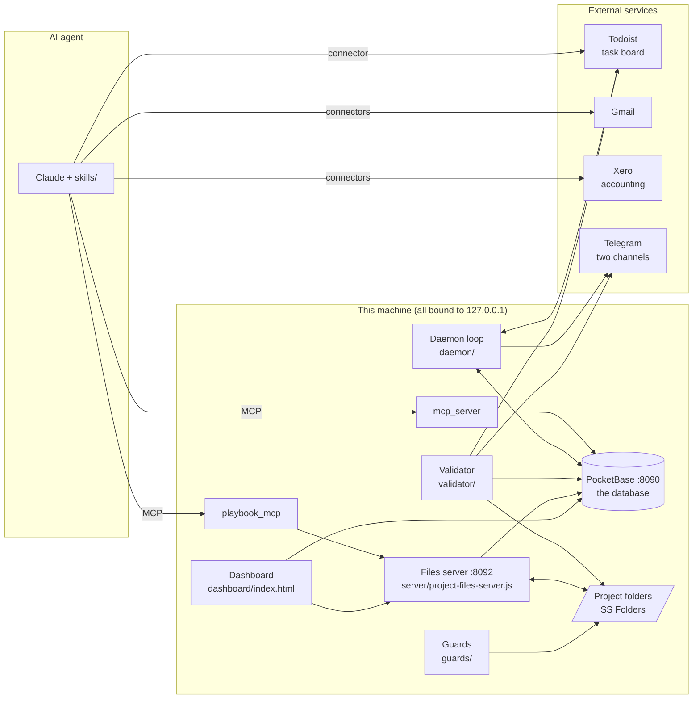

# Architecture

This document describes every part of the system: what runs, where data
lives, how it moves, and which file does what. For *why* the parts are
arranged this way, read [HARNESSES.md](HARNESSES.md) first.

## 1. The big picture



Everything in the "this machine" box is started by one script, `bin/start`.
The agent is Claude (Claude Code or Claude Desktop) with the MCP servers
registered and the skills installed.

## 2. What runs, and on which port

| Process | Started by | Port | What it does |
|---|---|---|---|
| PocketBase | `bin/start` | 8090 | The database (SQLite underneath) with a REST API and an admin UI at `/_/` |
| Files server | `bin/start` | 8092 | Node, no dependencies. Serves project files, runs playbooks, serves logs, the Xero snapshot and a de-duplicated task feed to the dashboard |
| Daemon loop | `bin/start` | none | `python -m daemon loop --write`, one pass every 60 s |
| Folders guard | `bin/start` | none | Moves stray `PROJECT.md` files back into the project folders |
| Deliverables guard | `bin/start` | none | Moves stray quote/invoice documents into the right folder |
| Dashboard | `bin/start` opens it | none | A single HTML file opened in the browser; talks to :8090 and :8092 |
| `mcp_server` | Claude, on demand | stdio | 31 database tools for the agent |
| `playbook_mcp` | Claude, on demand | stdio | 6 tools that forward to the playbook engine on :8092 |
| Validator | the agent, the daemon, or by hand | none | `python -m validator run`, exits 0 / 1 / 2 |

`bin/start` supervises what it starts: PocketBase, the files server and
the daemon are restarted if they die (up to 5 times in 10 minutes). On
macOS, `bin/install-autostart` registers a launchd agent so the stack
starts at login.

## 3. Where data lives

| Store | What is in it | Source of truth for |
|---|---|---|
| **PocketBase** (`pb_data/`) | Clients, contacts, suppliers, jobs, quotes, invoices, bills, interactions, equipment, the task mirror (`assignments`), playbook runs, skill registry | Relationships and job state |
| **Todoist** | The task board: one project, seven sections | Task wording, dates and which column a task is in |
| **Project folders** (`SS Folders/`) | One folder per client and project: `PROJECT.md`, quote and invoice PDFs; `_Suppliers/<name>/RELATIONSHIP.md`; playbook specs and run records | Documents and the written project history |
| **Xero** | Invoices and bills | Money. The agent reads it through the Xero connector; `tools/xero_snapshot.py` saves a normalised copy for the dashboard |
| **`state/`** (gitignored) | The ledger `writes.jsonl`, bypasses, heartbeats, the Telegram outbox, the Xero snapshot | Machine state for one installation |
| **`reports/`** (gitignored) | One Markdown report per validator run, named by run id | Audit trail |
| **`backups/`** (gitignored) | A full JSON snapshot of the database, once a day | Recovery |

### The main collections

| Collection | One record is | Key fields |
|---|---|---|
| `clients` | A customer company | `name`, `aliases`, `status`, `critical` (sensitive account) |
| `contacts` | A person at a client | `client`, `email`, `role` |
| `suppliers` | A vendor or freight company | `name`, `aliases`, `specialty` |
| `jobs` | A project for a client | `status` (11 values, see below), `value`, `paid`, `has_shipping`, `status_changed_at/by` |
| `quotes` / `invoices` / `bills` | Money documents | `client`, `job`, `amount`, `status` |
| `assignments` | The mirror of one Todoist task | `todoist_id`, `content`, `section_name`, `due_date`, `real_due`, `client`, `job`, `on_complete_job_status` |
| `interactions` | An email, call, meeting or note | `source_key` (unique), `client`, `job`, `supplier` |
| `equipment` | A machine at a client site | `category`, `make`, `model`, `lat`, `lng` |
| `project_financials` | One money line on a project | `direction`, `kind`, `currency`, `amount_gross`, `gst_treatment` |
| `playbook_runs` | One execution of a playbook | `playbook_id`, `status`, `steps` |

The job statuses, in pipeline order, are defined once in
`core/job_status.py` and must match the dashboard and the database:
`quoting, quoted, won, invoicing, invoiced, commissioning, completed`,
plus the side states `on_hold, lost, cancelled, reengage`. A test checks
the three copies agree.

The whole schema is created by the single migration in `pb_migrations/`.
`core/schema.py` is a generated Python copy of it that the code checks
writes against (see section 6).

## 4. How data moves

### 4.1 The daemon loop

`daemon/loop.py` runs this every 60 seconds:

```
every pass     1. backup        once per day, before the first write
               2. reverse       dashboard edits -> Todoist
               3. sync          Todoist -> PocketBase assignments
               4. triggers      completed tasks move jobs; quote chases
               5. outbox        deliver any queued Telegram messages
once a day     6. sweep         the overdue ladder, after 05:00 local time
               7. prune         delete old sync_log records
when quiet     8. validate      if the ops channel has been quiet for 12 h
               9. watchdog      alarm if the ops channel is quiet for 24 h
```

A pass that raises is logged and the loop backs off for 5 minutes. After
20 failing passes in a row it stops, and `bin/start` restarts it. A pid
lock in `state/loop.pid` makes sure only one loop runs.

### 4.2 Forward sync: Todoist to PocketBase

`daemon/sync.py` gathers the Todoist tasks and the PocketBase records,
and `core/sync.py` (pure code, no network) works out the changes:

- Only fields Todoist owns are copied: content, description, priority,
  labels, due date, deadline, section, project.
- A new task gets a client link from `core/matching.py` and a job link
  from `core/jobmatch.py`, but only if the field is empty. A link set by
  a person is never overwritten.
- A task that is no longer open in Todoist is marked `completed`. Nothing
  is ever deleted.
- If Todoist returned fewer than half of the open tasks PocketBase knows
  about, the pass refuses to run. A broken API reply must not mark the
  whole board as done.

Before writing, the daemon exports the "before" state to `backups/`, and
every write goes through the ledger.

### 4.3 Reverse sync: dashboard to Todoist

When a task is edited, completed or deleted on the dashboard, the
dashboard does not change Todoist itself. It writes a marker on the
assignment record (`source="dashboard"` for an edit, or `archived=true`
with a `COMPLETE:` or `DELETE:` reason for a close), and
`daemon/reverse.py` pushes the change to Todoist on the next pass, adds a
comment to the task saying where the change came from, then clears the
marker. This keeps Todoist as the source of truth for tasks, keeps the
Todoist token out of the browser for these writes, and means every change
goes through the same ledgered write path as the rest of the daemon.

### 4.4 Triggers: finishing a task moves the job

`core/triggers.py` defines four rules, applied by `daemon/triggers.py`:

| Rule | What it does |
|---|---|
| R0 | Keep the `🔁 On complete: job to <status>` line in the task description and the `on_complete_job_status` field in step. |
| R1 | When a task with a trigger is completed, move its job to that status, forward only. Skipped for sensitive clients, and a move to `invoiced` needs an invoice record first. |
| R2 | When a job has sat in `quoted` for 7 days, create one chase task, scheduled into a free slot by `core/planner.py`. |
| R3 | When the job leaves `quoted`, close its automatic chase tasks. |

Each action is also logged as an interaction, so the client's history
shows why the job moved.

### 4.5 The overdue ladder and the real due date

In Todoist, an overdue task's due date is moved to yesterday every day
("parked"), so it stays visible at the top of the board. That means the
Todoist due date cannot tell you how late a task really is. So the first
due date is pinned into the description the first time the task goes
overdue:

```
📌 Real due: 2026-09-01 | 26 days late | 3 pushes
```

and mirrored in `assignments.real_due`. `core/realdue.py` owns this line:
it is written once and never moved to a later date. All ages are measured
from it. The ladder in `daemon/overdue.py`:

| Days past the real due date | Action |
|---|---|
| 1 | Move to the Overdue section and park on yesterday |
| 3 | Add the `@escalated` label |
| 7 | Telegram alert to the ops channel (once) |
| 14 | Add `@stall-warning` |
| 28 | Move to Stalled and clear the date |

Tasks waiting on someone else (recognised by `daemon/waiting.py`) are
routed to "Waiting on client" or "Waiting on supplier" instead, with chase
dates counted in business days. After two chases with no reply they go to
Stalled. The engine never completes or deletes a task.

### 4.6 Telegram

There are two channels. **General** gets day-to-day messages (new tasks,
sync summaries). **Ops** gets validator results and escalations only, so
failures cannot get lost in routine chatter. `core/notify.py` never raises;
a failed send is written to `state/telegram-outbox/` by `core/outbox.py`
and delivered by the daemon on a later pass.

## 5. The dashboard

`dashboard/index.html` is a single-file React app compiled in the browser
by Babel, so there is no build step. It reads PocketBase and the files
server directly and polls every 30 seconds. Pages include a KPI overview,
clients, contacts, jobs, quotes, invoices and bills, suppliers,
interactions, a timeline with map, list, calendar, Gantt and workload
views, an equipment map, project files, playbook runs, logs and the skill
registry.

Four small engines sit beside it, each a plain script with its own tests:

| File | What it does |
|---|---|
| `filter_engine.js` | The workload filter pipeline. Invariant: a filter chip's count always equals the number of cards you get by clicking it. |
| `quality_engine.js` | Declarative data-quality rules (missing address, job with no value, and so on) shown as chips. |
| `streamer_engine.js` | "Streamer mode" for screen sharing: masks names, money and contact details, and blocks writes while active. |
| `snapshot_shim.js` | For the hosted read-only copy: answers reads from a frozen snapshot and refuses every write. See [HOSTED-DASHBOARD.md](HOSTED-DASHBOARD.md). |

Because Babel compiles the page in the browser, a syntax error would only
show up when the page is opened. `tests/test_dashboard_syntax.py` compiles
it with Babel during the test run to catch that earlier.

## 6. Configuration and the schema

- **`config/settings.yaml`** holds every port, path, id, interval and
  threshold. Code never hard-codes these.
- **`.env`** holds secrets only (tokens, passwords). It is the only file
  secrets are read from, and it is gitignored. Real environment variables
  take priority over it.
- **`config/validation-rules.yaml`** is the complete definition of what
  the validator checks.
- **`core/schema.py`** is generated from the running database by
  `python -m tools.introspect_schema --write`. `core/pb.py` checks every
  write against it, and the `schema_drift` rule fails if the database and
  this file disagree. To change the schema: change the database (the
  admin UI writes a migration into `pb_migrations/`), regenerate
  `core/schema.py`, run the tests, commit both.

## 7. File map

```
bin/                  shell entry points
  start               start and supervise the whole stack (--check to diagnose)
  splatt-validate     run the validator the way the agent does
  sync-skills         copy skills/ into ~/.claude/skills and register them
  install-autostart   start the stack at login (macOS launchd)
  publish-dashboard   build and deploy the hosted read-only dashboard
config/               settings.yaml, validation-rules.yaml
core/                 shared library, imported by everything else
  config.py           settings + .env loader
  pb.py               PocketBase client: schema check, read-back, re-auth
  schema.py           GENERATED copy of the database schema
  ledger.py           append-only record of claimed writes
  todoist.py          Todoist API client
  notify.py outbox.py Telegram with a retry outbox
  interactions.py     the one write path for interactions
  sync.py reverse.py triggers.py    pure planners for the daemon
  matching.py jobmatch.py evidence.py  refuse-rather-than-guess linkers
  realdue.py planner.py             real due dates and scheduling
daemon/               the always-on loop and its passes
validator/            the independent checker
  checks/standing.py  standing and money checks
  checks/requirements.py  the building blocks of the state gates
mcp_server/           the agent's database tools
playbook_mcp/         the agent's playbook tools (proxy to :8092)
server/               the Node files + playbook server
guards/               background file tidiers
dashboard/            the single-file dashboard and its engines
skills/               the agent's instructions (the AI harness)
tools/                one-command utilities (schema, backups, demo data, setup)
pb_migrations/        the initial database schema
examples/SS Folders/  a demo project-folder tree with example playbooks
tests/                pytest and node test suites
```

## 8. Testing

```
.venv/bin/python -m pytest        # Python suites (and the JS suites, via test_node_suites.py)
npm test                          # the JS suites on their own
```

Most tests run fully offline against fakes in `tests/fakes.py` (a fake
PocketBase and a fake Todoist) and `tests/conftest_splatt.py`. The two
tests that compare against a live database skip cleanly when no database
or credentials are available.
