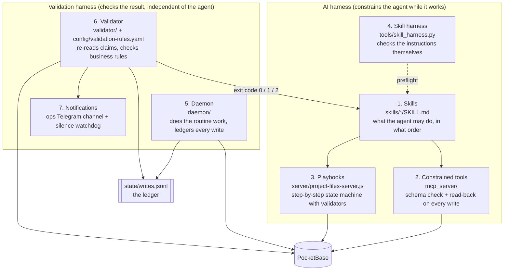
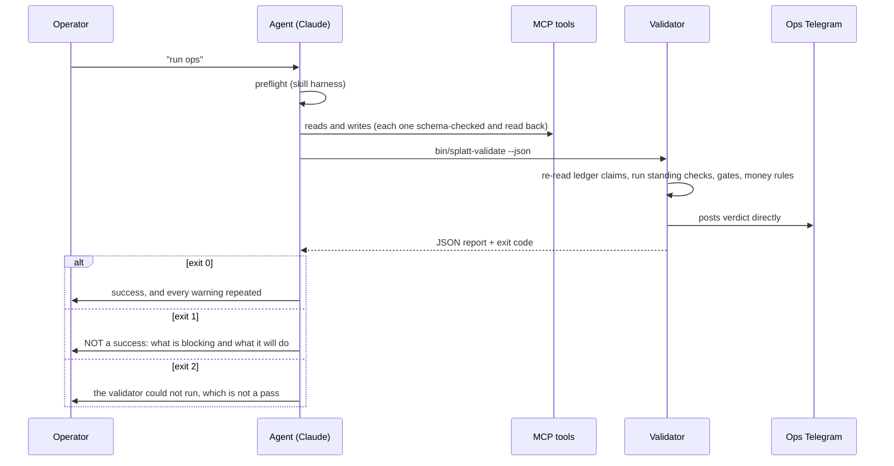

# How the AI harness and the validation harness check each other

This document explains the central idea of the project. It is the part I
would most like a reader to understand, so it goes slowly and gives
examples.

## 1. The problem

Splatt Engineering is a small industrial engineering business. Most of the
work arrives as email: a client asks for a price, a supplier sends a quote,
a freight company says a shipment has landed. Each of those emails means
something has to happen in three or four places: a task on the Todoist
board, a record in the database, a line in the project file, and sometimes
an invoice in Xero.

An AI agent (Claude) is very good at the first half of that job. It can
read a long email thread, work out that "yes, go ahead with option B" means
the quote was accepted, and draft a sensible reply. Ordinary code cannot do
that.

The same agent is unreliable at the second half, the bookkeeping. In
practice the failures look like this:

- It says "I've updated the job to *won*" when the write was rejected, or
  was never made.
- It skips a step in a procedure (files the quote PDF in the supplier folder
  but not in the project folder).
- It reports "all done" at the end of a run because it *remembers* doing
  the work, not because it checked.
- Its instructions go stale (a Todoist section it was told to use has been
  deleted) and it carries on anyway.

Deterministic code has exactly the opposite profile: it cannot read an
email, but it never forgets a step and it can check a claim against the
database every time.

So the system is built as two halves that each cover the other's weakness:

| | The AI harness | The validation harness |
|---|---|---|
| What it is | Claude, plus the instructions in `skills/` and the tools it is allowed to call | Plain Python: `validator/`, `core/ledger.py`, `core/pb.py`, the daemon |
| Good at | Judgement: reading, classifying, deciding, drafting | Bookkeeping: checking, repeating, never skipping |
| Bad at | Remembering, reporting its own success honestly | Anything that needs reading between the lines |
| Its job here | Do the work that needs judgement | Decide whether the work actually happened, and do the routine work so the agent does not have to |

The word *harness* is used in the sense of a test harness: the structure
that surrounds something and controls what it can do and how it is
checked.

## 2. The layers

There are seven layers. The first four constrain the agent while it works.
The last three check the result, and they are independent of the agent.

### Layer 1: Skills (the agent's instructions)

A skill is a Markdown file that Claude loads when a request matches it.
`skills/splatt-ss-agent/SKILL.md` is the main one. It contains:

- **Hard rules.** Never send an email (drafts go into the chat for the
  operator to send). Never create a Xero invoice without an explicit
  instruction. Never draft anything for a client flagged as sensitive
  (`clients.critical = true`). Ask when unsure.
- **The ops cycle**, a fixed sequence: preflight, gather (email, board,
  database), analyse, act, report, validate.
- **Data conventions** that the daemon and validator depend on, such as the
  `📌 Real due:` line at the top of a task description and the
  `🔁 On complete: job to quoted` trigger line (see `skills/splatt-todoist`).

Skills are the weakest layer on their own, because an instruction is only
a request. Every later layer exists so that ignoring an instruction is
either impossible or gets caught.

### Layer 2: Constrained tools (the MCP server)

The agent does not get raw database access. It gets 31 tools from
`mcp_server/server.py` (search_clients, update_job, log_interaction, and so
on). Every write they make goes through `core/pb.py`, which does three
things the agent cannot skip:

1. **Schema check before sending.** The payload is compared with
   `core/schema.py` (generated from the real database). A field that does
   not exist, a missing required field, or a value outside a select list is
   refused locally, with the field named. This matters because PocketBase
   silently drops unknown fields: without this check, a write with a
   misspelled field name returns "200 OK" and saves nothing.
2. **Read-back after writing.** PocketBase returns the stored record. The
   client compares it with what was sent (`values_match` in `core/pb.py`,
   which treats `5` and `"5.0"` as equal but `False` and "missing" as
   different). If a value did not land, it raises `WriteNotLanded`, and the
   agent is told "the write did not save" instead of "done".
3. **Idempotent interactions.** Logging an email goes through
   `core/interactions.save`, which keys each record on a `source_key` such
   as `gmail:18f0000000000001`. Logging the same email twice updates one
   record instead of creating two. A unique index in the database backs
   this up even if the code is wrong.

So when the agent says "saved", it is repeating what the tool told it, and
the tool only says "saved" after checking.

### Layer 3: Playbooks (procedures the agent cannot shortcut)

Some jobs are multi-step procedures where skipping a step is the typical
failure, for example "a supplier sent a quote": download the PDF, file it
in two folders, create the quote record, update the supplier file, update
the project file.

These are written as playbook specs (JSON, see
`examples/SS Folders/_howtotasks/playbooks/`). The files server runs them
as a strict state machine, and the agent drives it through the
`splatt-playbook` MCP tools:

1. `playbook__start` opens a run and returns step 1.
2. The agent does the step, then calls `playbook__step` with
   `status="done"` and the evidence the step asks for.
3. The server runs that step's **validators** before accepting it:
   `extracted_fields` (the agent must supply these values),
   `file_modified` (this file must have changed since the run started),
   `pocketbase_record` (a matching record must exist), and others for
   Gmail, Todoist and Xero.
4. If a validator fails, the server answers HTTP 400 with the list of
   failed validators, and the run does not move on. Steps must be done in
   order.
5. The last step triggers `final_validation`. The run ends as `completed`
   or `failed_validation`. Runs are saved as JSON and mirrored to the
   `playbook_runs` collection.

A run the agent starts and never finishes is itself caught later by the
validator rule `no_dangling_playbook_runs`.

### Layer 4: The skill harness (checking the instructions)

The instructions can be wrong too. If a skill tells the agent to move tasks
into a Todoist section that has since been deleted, the agent will fail in
confusing ways, or worse, succeed somewhere else.

`tools/skill_harness.py` keeps a registry of the skills in PocketBase
(`skills`, `skill_refs`, `skill_routes`, `skill_invocations`). It extracts
hard-coded references from skill text, checks them against live Todoist,
and offers a `preflight` command that the agent runs at the start of an
ops cycle. If a referenced id no longer exists, preflight exits with code 3
and the agent must stop and report instead of carrying on. Each run's
outcome is logged as a `skill_invocations` row.

In this public edition the skills read all ids from
`config/settings.yaml` instead of hard-coding them, which is the better
fix: there is nothing in the skill text to go stale.

### Layer 5: The daemon (routine work the agent should not have to remember)

A lot of what goes wrong with an agent is simply forgetting. The daemon
(`python -m daemon loop --write`) takes the routine, rule-based work away
from the agent entirely. Every 60 seconds it:

- mirrors the Todoist board into PocketBase (and pushes dashboard edits
  back to Todoist),
- fires **triggers**: when a task carrying `🔁 On complete: job to quoted`
  is completed, the job's status moves forward; a job left in `quoted` for
  7 days gets a chase task automatically,

and once a day it runs the **overdue ladder** (move to Overdue after 1 day,
label `@escalated` after 3, alert the operator after 7, warn after 14,
move to Stalled after 28). It never completes or deletes anything.

Every write the daemon makes goes through `RecordingClient`
(`core/ledger.py`), which appends a line to `state/writes.jsonl`: which
record, which fields, which run. This is the **ledger**. It is the daemon's
list of claims, and the validator treats it as claims to be checked, not
as facts.

### Layer 6: The validator (the independent judge)

`validator/` is deliberately separate. It shares only the database and
Todoist clients from `core/`, never imports the daemon, and trusts nothing
it did not read itself. Its rules live in `config/validation-rules.yaml`,
in three groups:

- **Standing checks**, run every time. Did every write in the ledger land
  (`writes_landed`: re-read the record and check each claimed field)? Has
  the database schema drifted from `core/schema.py`? Do Todoist and
  PocketBase agree? Are there orphan records? Is every promise in a
  project file (an "⚪ Waiting" or "TBC" row) backed by a Todoist task? Are
  any playbook runs left open?
- **State gates**, evaluated for every job according to its status. A job
  is not really `quoted` until a quote record exists and the quote PDF is
  filed. It is not `invoiced` until an invoice record exists. A `paid` flag
  needs the paid amount to match the invoice within tolerance.
- **Money gates**, which can never be waived. Shipping on a job must be
  recharged. A supplier bill that was paid must be recovered from the
  client or covered by an open task. A bill with no job attached is a cost
  that will never be recharged.

Each rule has a severity: `block` (the run may not be reported as a
success) or `warn` (it may, but the warning must be repeated to the
operator).

Three properties make the verdict trustworthy:

1. **A check that crashes is an ERROR, never a pass.** A broken check must
   not look like a clean one.
2. **A rule cannot point at a check that does not exist without being
   noticed.** If a rule names a check function that is not registered, it
   produces an ERROR result (not a pass) every time it runs, and a test in
   `tests/test_validator.py` fails if the shipped rules file names one. A
   malformed rules file (a missing id, an unknown severity, an exception
   without an end date) is refused when it loads.
3. **Waivers are explicit and temporary.** A *bypass* is granted by the
   operator on the command line with a reason, is recorded, and expires
   after 72 hours. A temporary *exception* (softening a rule while data is
   cleaned up) must have an end date at most 90 days away and a written
   reason, and the rule returns to full strength the day after that date, by itself.
   Rules marked `bypassable: false` (all money rules, and `writes_landed`)
   cannot be waived at all.

### Layer 7: Notifications (the agent cannot hide a failure)

The validator posts its own verdict to a separate ops Telegram channel.
The agent is not in that path, so it cannot soften or drop a failure. And
because a validator that silently stops running would look exactly like a
validator that finds nothing wrong, the daemon also:

- runs the validator by itself whenever the ops channel has been quiet for
  12 hours, and
- raises a "silence is a fault" alarm if the ops channel has been quiet for
  24 hours.

## 3. The end-of-run contract

This is the point where the two halves meet. At the end of every ops run,
the skill requires the agent to run the validator and to report from its
verdict, not from memory:

The JSON report contains:

| Key | Meaning |
|---|---|
| `verdict` | `PASSED`, `PASSED WITH WARNINGS` or `BLOCKED` |
| `may_report_success` | `true` or `false`. This is the answer, not a hint. |
| `counts` | how many checks passed, failed, errored, were skipped or bypassed |
| `blocking` | the failures that stop the agent reporting success |
| `warnings` | failures the agent may report around, but must mention |
| `skipped` | checks that could not be evaluated. These are not passes. |
| `bypassed` | checks the operator waived, with the reason |
| `exceptions` | rules currently softened, with the end date and days left |
| `notes` | anything else the run wants to say |

Exit codes: `0` passed (warnings allowed), `1` blocked, `2` the validator
itself could not run. Exit 2 is treated as seriously as exit 1, because a
checker that did not run has checked nothing.

The agent must also never grant a bypass itself (only the operator can
run `python -m validator bypass`), and must read out any temporary
exceptions and their countdown every run, so the day an exception expires
is not a surprise.

## 4. Who catches what

The easiest way to see how the layers cover each other is to go through
concrete failures.

| What goes wrong | Caught by | How |
|---|---|---|
| The agent writes a field name that does not exist | Layer 2 | The schema check refuses the write and names the field |
| The agent says it saved a value, but the database dropped it | Layer 2 | Read-back raises `WriteNotLanded`; the tool reports failure |
| The same email is logged twice | Layer 2 | `source_key` lookup updates the existing record; unique index as backstop |
| The agent skips filing a quote PDF | Layers 3 and 6 | The playbook step's `file_modified` validator returns 400; later `gate_quoted` fails for the job |
| The agent starts a procedure and abandons it | Layer 6 | `no_dangling_playbook_runs` |
| The agent's instructions point at a deleted Todoist section | Layer 4 | Preflight exits 3 and the agent stops |
| The agent forgets to chase a quote | Layer 5 | Trigger R2 creates a chase task after 7 days in `quoted` |
| A task is ignored for weeks | Layer 5 | The overdue ladder escalates, alerts, then parks it as Stalled |
| A daemon bug claims a write that never landed | Layer 6 | `writes_landed` re-reads every ledger claim |
| The agent reports success while rules are failing | Layers 6 and 7 | Exit code 1 and `may_report_success: false`; the verdict also goes straight to Telegram |
| Freight was paid but never charged on to the client | Layer 6 | Money gate `shipping_not_forgotten`, which cannot be waived |
| The validator crashes or stops running | Layers 6 and 7 | Exit 2 is not a pass; the daemon re-runs it after 12 quiet hours and alarms after 24 |
| A rule is wrong and blocks every run | Operator | A bypass (reasoned, recorded, 72 h) or a dated exception (at most 90 days) |
| The rules themselves go out of date | Layer 6 | `rules_are_fresh` warns when a rule has not been reviewed for 180 days |

## 5. Where the AI covers for the code

The checking only works in one direction if the deterministic side is
allowed to guess. So the code is written to **refuse rather than guess**,
and to hand anything uncertain to the agent or the operator:

- `core/matching.py` links a task title to a client by name and alias. If
  two clients match equally well, it refuses and links nothing.
- `core/jobmatch.py` places a task under a job only when there is
  evidence (a quote number, a phrase from the job title). Otherwise it
  returns a reason: `NO_CLIENT`, `NO_LIVE_PROJECT`, `NO_EVIDENCE` or
  `AMBIGUOUS`.
- `core/evidence.py` decides whether an email proves a task is done. It
  needs a quote, invoice or PO number in the task title that also appears
  in the email, and it never closes a money task on email evidence alone.
  Anything weaker comes back as `MAYBE` or `UNKNOWN`.
- `core/sync.py` refuses to apply a pass if Todoist returned less than half
  of the tasks it expected, rather than marking the rest as completed.
- The overdue engine refuses to run at all if a board section id is
  missing from the config.

Every refusal lands somewhere the agent reads: an unlinked task, a
"needs decision" list from the sweep, a validator warning. The agent then
does the part that needs judgement (reading the thread to see which job a
task belongs to, deciding whether a vague email really confirms delivery)
and its decision goes back through layers 2 to 6 to be checked like
everything else.

That loop is the whole design: **the code refuses when it is unsure, the
agent decides, and the code checks the decision.**

## 6. Known limitations

These are honest gaps in the current version, listed so nobody has to
discover them.

- **Agent writes are verified, but not ledgered.** Writes through the MCP
  server are schema-checked and read back at the moment they happen, but
  they are not appended to the ledger, so `writes_landed` does not re-check
  them later. The state-level rules (gates, money, orphans) still check the
  result of those writes, whoever made them.
- **The ledger is scoped by run id.** Each process gets one run id at
  start-up. A validator run inside the daemon covers the daemon's writes; a
  separate `bin/splatt-validate` gets a new run id and only sees its own
  run's claims unless it is given `--run-id`.
- **Two validation actions are reserved.** `config/validation-rules.yaml`
  names `todoist_task` and `log_interaction` actions that the code does not
  execute yet; only the Telegram actions run.
- **The skill harness only recognises Todoist ids** when it scans skill
  text for references. Email, path and URL patterns exist in the code but
  are not used yet.
- **Playbook specs live with the project files**, not in the repo. Three
  example specs are included under `examples/`.
